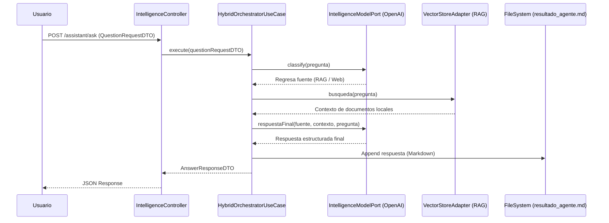

# Hybrid AI Orchestrator 🤖🌐

[](https://openjdk.org/)
[](https://spring.io/projects/spring-boot)
[](https://spring.io/projects/spring-modulith)
[](https://www.docker.com/)
[](https://openai.com/)
[](https://github.com/langchain4j/langchain4j)

**Hybrid AI Orchestrator** es una solución de alto rendimiento para la orquestación de inteligencia artificial, desarrollada con **Java 21**, **Spring Boot 4** y **Spring Modulith**. El sistema actúa como un motor de decisión dinámico que determina si una consulta debe ser resuelta mediante **RAG (Retrieval-Augmented Generation)** utilizando documentos locales (PDF) o a través de búsqueda general.

## 🎥 Demo


Implementado bajo los principios de **Arquitectura Hexagonal (Ports & Adapters)** y **Diseño Modular**, el proyecto garantiza una separación clara entre la lógica de negocio y los componentes de infraestructura, optimizando la escalabilidad y la facilidad de mantenimiento. Además, el sistema persiste cada respuesta generada en un archivo local `resultado_agente.md` para su posterior auditoría.

---

## 🏗️ Arquitectura y Diseño

### Estructura Modular (Spring Modulith)
El proyecto utiliza **Spring Modulith** para organizar el dominio en módulos lógicos bien definidos, facilitando la observabilidad y garantizando que las dependencias entre módulos respeten la arquitectura hexagonal.

### Flujo de Interacción


### Estructura de Directorios
```text
hybrid-intel-orchestrator/
├── documents/                      # Documentos locales para RAG (PDFs de ejemplo)
├── src/main/java/com/jimsimrodev/orchestrator/
│   ├── config/                     # Configuración de Beans (AI Models, VectorStore, CORS)
│   └── module/
│       ├── api/                    # Adaptador de Entrada: REST Controller
│       ├── aplication/             # Capa de Aplicación
│       │   ├── dto/                # Objetos de Transferencia de Datos (DTOs)
│       │   ├── port/               # Puertos de Entrada/Salida (Interfaces)
│       │   └── usecase/            # Lógica de Orquestación y Persistencia
│       ├── domain/                 # Capa de Dominio (Entidades y Excepciones)
│       └── infra/                  # Adaptadores de Salida (Infraestructura)
│           ├── adapter/
│           │   ├── ia/             # Adaptador para OpenAI (LangChain4j)
│           │   └── persistence/    # Adaptador para Vector Store (RAG)
│           └── service/            # Servicios de Ingestión y Procesamiento
└── Dockerfile                      # Definición de imagen Multi-stage
```

---

## 📂 Documentos de Ejemplo Incluidos
El proyecto incluye una carpeta `documents/` con archivos PDF pre-cargados para probar las capacidades RAG:
- `Guía de Flora Exótica del Planeta X.pdf`
- `Manual de Operaciones - Estación Es.pdf`
- `Política de Reembolsos de.pdf`

---

## 🛠️ Instalación y Configuración

### Requisitos Previos
- **JDK 21** o superior.
- **Maven 3.9.6+**.
- Cuenta y **OpenAI API Key**.

### Configuración de Variables de Entorno
Puedes configurar el sistema mediante variables de entorno o editando `src/main/resources/application.yaml`:

| Variable | Descripción | Valor por Defecto |
|----------|-------------|-------------------|
| `MY_API_KEY` | Tu OpenAI API Key | (Requerido) |
| `app.documents-path` | Ruta absoluta a los documentos RAG | `/app/documents` |

**Ejemplo de ejecución local con Maven:**
```bash
export MY_API_KEY=tu_clave_aqui
mvn spring-boot:run
```

---

## 🐳 Despliegue con Docker

### Orquestación con Docker Compose
El archivo `docker-compose.yml` monta automáticamente la carpeta `documents/` del host en el contenedor.

```bash
# 1. Asegúrate de tener tu API Key en una variable de entorno
export OPENAI_API_KEY=tu_clave_aqui

# 2. Levanta el contenedor
docker-compose up -d
```

El servicio estará disponible en `http://localhost:5001`.

---

## 🚀 Uso de la API

### Realizar una consulta
**Endpoint:** `POST /assistant/ask`

**Cuerpo (JSON):**
```json
{
  "pregunta": "¿Cuáles son los requisitos para un reembolso según la política?"
}
```

**Respuesta:** El sistema clasificará la pregunta como **RAG**, buscará en `Política de Reembolsos de.pdf`, generará una respuesta enriquecida en Markdown y la guardará en `resultado_agente.md`.

---
Desarrollado por [Jimsimrodev](https://github.com/jimsimrodev) - Experto en DX y Cloud Computing.
